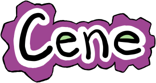

# Cene

<p align="center">
  <a href="https://era-platform.github.io/cene/">
    
  </a>
</p>

[](https://github.com/era-platform/cene/actions/workflows/ci.yml)

[Visit the Cene website.](https://era-platform.github.io/cene/)

[Run some Cene code in your browser, logging to the console.](https://era-platform.github.io/cene/demos/cene.html)

[Run some reader unit tests in your browser, logging to the console.](https://era-platform.github.io/cene/demos/unit-tests.html)

[Run the reader in your browser. This page is interactive!](https://era-platform.github.io/cene/demos/reader.html)

[See documentation of the built-in operations](https://cene.readthedocs.io/en/latest/)

Cene is a programming language dedicated to simplifying the experience of programming on all fronts. This makes it a lot like the other language experiments in the [Era project](https://github.com/era-platform/era), but Cene is the furthest along and the most practical. Unlike the Era projects that came before it, Cene is designed to be useful as part of a command-line build system.

In fact, Cene basically is a build language, although instead of coordinating the invocation of external compilers, a Cene program generates target-language programs by crawling the code of its own function definitions. This way, a library can be written once in Cene and compiled to multiple target languages (although for now, we only support JavaScript).


## Various specific features

Cene offers simple approaches to several problems that few other programming languages attempt to solve.


### Weak opening parens

Cene's weak opening parens are a simple syntactic feature that allows deep conditionals and continuation-passing code to be written as linear code blocks:

```
(if condition-1
  alternative-1
  (if condition-2
    alternative-2
    alternative-3))

(if condition-1
  alternative-1
/if condition-2
  alternative-2
  alternative-3)

(do-thing-1
  (fn result-1
    (do-thing-2 result-1
      (fn result-2
        (do-thing-3 result-1 result-2)))))

(do-thing-1 /fn result-1
/do-thing-2 result-1 /fn result-2
/do-thing-3 result-1 result-2)
```

For more information, see [Parendown](https://github.com/lathe/parendown-for-racket), a library we've made to bring this functionality to Racket.


### Purity and controlled side effects

Since Cene makes continuation-passing style so much more palatable, Cene's side effects take advantage of this. If a side effect needs to be observable by later computations, it uses continuation-passing style (or more specifically, monadic style).

Side effects that only read from the outside world rather than writing to it use a world-passing style instead.

```
\= Copies one tree of UTF-8 files to another file tree recursively.
(defn copy-paths mode in out
  \= We read and branch on the type of the input file.
  (case (input-path-type mode in)
    
    \= If it's a directory, we loop over the directory listing.
    file-type-directory
    (foldr (input-path-directory-list mode in) (no-effects/nil)
    /fn item then
      \= We invoke a copy recursively, and in the meantime we proceed
      \= with other effects in the loop.
      (join-effects
        (copy-paths mode
          (input-path-get in item)
          (output-path-get out item))
        then))
    
    \= If it's a blob, we read the blob as UTF-8 text and write it to
    \= the output path.
    file-type-blob
    (output-path-blob-utf-8 out /input-path-blob-utf-8 mode in)
  
  \= If we don't recognize the type of file, we just do nothing with
  \= it.
  /no-effects/nil))
```

This approach allows everything else in Cene to be pure functional programming. Pure Cene functions are allowed to diverge, run out of memory, or otherwise exhaust the program's resources, but that's the extent of the side effects they can perform on their own. (We consider run time errors to be a kind of resource exhaustion.)

We take advantage of this purity in some places in Cene's design to avoid exposing unstable implementation details to Cene programs. For instance, Cene has a table data structure similar to hash tables, but unlike other languages whose hash tables expose an arbitrary iteration order that's subject to change, Cene ensures its hash tables' iteration order can't be observed at all by a terminating Cene program.

Cene is an untyped language and can cause errors at run time. We consider a run time error to be a kind of resource exhaustion.


### Macros

Cene has Lisp-like syntax and support for macros. Cene's approach to hygiene involves explictly passing around namespaces and resolving symbols in terms of them.

Our goal with this is to allow Cene's evolution as a language to sometimes result in a *simpler* language that implements the previous design as a library. Many languages accumulate complexity over time, but sufficiently macro-capable and modular languages can reverse the process.

Cene's macro calls are capable of cooperating using concurrent access to monotonic state resources. This is a deterministic concurrency model that's similar to [LVar](https://github.com/lkuper/lvar-examples)s, and we expect to implement various things like multimethod systems and static type systems in terms of this infrastructure.


### Nested string quasiquotation

Cene has a string syntax with a few more bells and whistles than usual. Borrowing an idea from Scheme's `quasiquote` and Common Lisp's `backquote`, Cene's string syntax can be _nested_. This means Cene code generators can be written in Cene while only rarely requiring escape sequences. In order to support nesting, the string syntax itself looks just like an escape sequence, `\;qq[...]`.

Not that it's actually advisable, but using this syntax, we can build multi-stage programs in a style where each step of the computation generates another Cene program to run the next step:

```
(do-thing-1 /fn result-1
  \;qq[
    (do-thing-2 \;uq;ls`result-1` /fn result-2
      \;qq[(do-thing-3 \;uq;uq;ls`result-1` \;uq;ls`result-2`)])
  ])
```

And since this style of program is similar to continuation-passing style, we can take advantage of Cene's weak opening parens to make it even easier to write:

```
(do-thing-1 /fn result-1 \;qq/
\/do-thing-2 \;uq;ls`result-1` /fn result-2 \;qq/
\/do-thing-3 \;uq;uq;ls`result-1` \;uq;ls`result-2`)
```

Note the use of ``\;uq;ls`result-1` `` in the above code to interpolate `result-1` into the string. In the call to `do-thing-3`, we write ``\;uq;uq;ls`result-1` `` to escape from two layers of quotation at once. This is the kind of scenario that Scheme and Common Lisp programs use `,',` for, but we support it directly in the syntax.

The above might still look a little annoying to write. The number of times we have to write `;uq` in our ``\;uq;uq;ls`result-1` `` varies depending on where we are in the program. It's as though we have to keep track of the de Bruijn index of `result-1` as we go along.

Usually, programming languages don't require people to refer to variables by de Bruijn index. So Cene provides a way to give labels to quotation levels using the `wq` and `rq` notations:

```
(do-thing-1 /fn result-1 \;(wq r1);qq/
\/do-thing-2 \;(rq r1);ls`result-1` /fn result-2 \;(wq r2);qq/
\/do-thing-3 \;(rq r1);ls`result-1` \;(rq r2);ls`result-2`)
```

In most programs with halfway reasonable architectures, nested quasiquotations are exceedingly rare. Most macro-generating macros with one or two levels of nested quotation are remarkable enough to be pulled out into their own extensively documented libraries, and it's generally advisable to use a library of that sort rather than hacking together a one-off code generator that might suffer from a code injection attack. But in case you happen to have found your way into a situation where generating code is genuinely helpful, Cene is accommodating.

At the moment, Cene has all this support for quasiquoting strings, but it doesn't yet have quotation for s-expressions. We could copy the approach we took for string quotation, but before diving into that, we've decided to take some time to investigate the underpinning mathematical structure of `quasiquote`-shaped operations so that we can factor out these various notational extensions into appropriate pieces. The [Punctaffy](https://github.com/lathe/punctaffy-for-racket) project has come out of this investigation.


## Installation and use

Install Node.js. Recent versions of Node.js come with npm.

Depending on your needs, you may want to install Cene locally or globally:

```
npm install cene
npm install --global cene
```

A global installation lets you easily invoke cene at the command line:

```
cene my-build.cene --in my-src-dir/ --out my-output-dir/ arg1 arg2
```

For a complete example project written in Cene, check out [Cene Scaffold](https://github.com/era-platform/cene-scaffold).

Cene also supports being loaded as a Node.js library. It has only two exports:

```js
var cene = require( "cene" );
cene.runCeneSync( cene.preludeFiles.concat( [ "my-build.cene" ] ), {
    args: [ "arg1", "arg2" ],
    in: "my-src-dir/",
    out: "my-output-dir/"
} );
```

If you use this technique to run Cene, it's a little bit more flexible than the command-line tool. You can supply more than one filename of your own to be executed in sequence, and you can choose not to include the prelude files, which the Cene command-line tool always includes.
